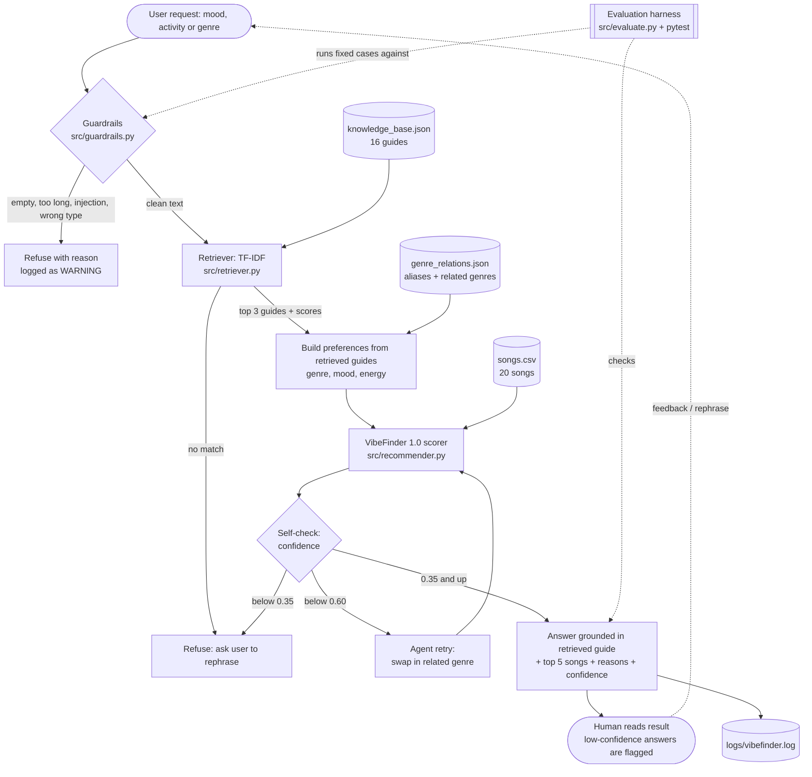

# System architecture

Source of truth: [`architecture.mmd`](architecture.mmd).

```mermaid
flowchart TD
    U([User request: mood, activity or genre]) --> G{Guardrails<br/>src/guardrails.py}
    G -- empty, too long, injection, wrong type --> R1[Refuse with reason<br/>logged as WARNING]
    G -- clean text --> RET[Retriever: TF-IDF<br/>src/retriever.py]
    KB[(knowledge_base.json<br/>16 guides)] --> RET
    RET -- no match --> R2[Refuse: ask user to rephrase]
    RET -- top 3 guides + scores --> PLAN[Build preferences from retrieved guides<br/>genre, mood, energy]
    REL[(genre_relations.json<br/>aliases + related genres)] --> PLAN
    PLAN --> SCORE[VibeFinder 1.0 scorer<br/>src/recommender.py]
    CAT[(songs.csv<br/>20 songs)] --> SCORE
    SCORE --> CHK{Self-check:<br/>confidence}
    CHK -- below 0.60 --> RETRY[Agent retry:<br/>swap in related genre]
    RETRY --> SCORE
    CHK -- below 0.35 --> R2
    CHK -- 0.35 and up --> OUT[Answer grounded in retrieved guide<br/>+ top 5 songs + reasons + confidence]
    OUT --> H([Human reads result<br/>low-confidence answers are flagged])
    OUT --> LOG[(logs/vibefinder.log)]
    T[[Evaluation harness<br/>src/evaluate.py + pytest]] -. runs fixed cases against .-> G
    T -. checks .-> OUT
    H -. feedback / rephrase .-> U
```
